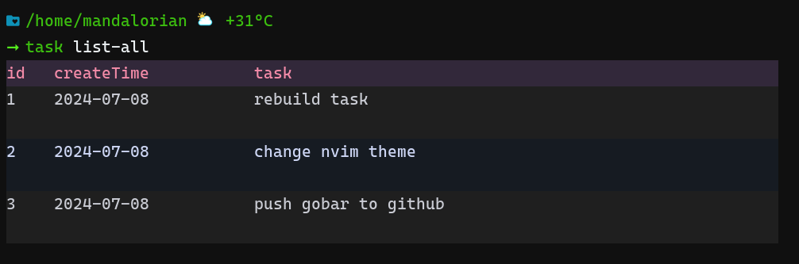

# TASK

It is a simple task program, mainly used to learn golang. It is simple to use, download
the task binary, add to system path. It will create a sqlite database under `~/.local/share/task/`
when the first time running.

```shell
chmod +x ./task
cp task ~/.local/bin
```

1. initial sqlite database

    ```shell
    task init
    ```

2. then add task

    ```shell
    task add 'It is time to eat'
    ```

3. check task

    ```shell
    task list
    ```

 
